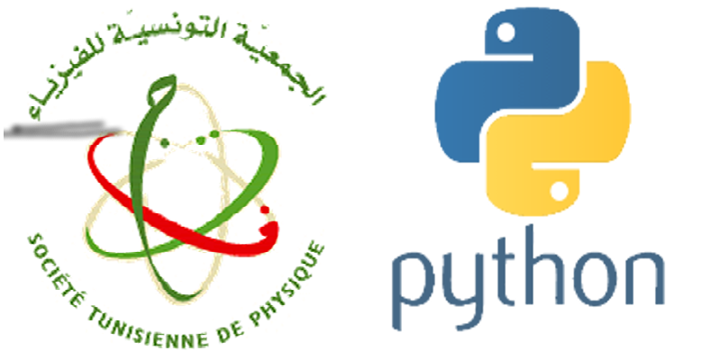

# Formation Python pour les scientifiques

Cette formation a pour but l'initiation: des étudiants en mastère, des doctorants et éventuellement des enseignants, à l'utilisation de Python pour apprendre à développer des codes interfacés et adaptés à leurs projets d'étude. 

<h4>Société Tunisienne de Physique ; 09-10-11  avril 2021</h4>

<h4>Faculté des Sciences de Tunis</h4>

 

 

## Formateur

* Dr. Ahmed Ammar (1,2)

1. Faculé des Sciences de Tunis, Université de Tunis El Manar.
2. Institut Préparatoire aux Études Scientifiques et Techniques, Université de Carthage.

## Programme

### Atelier I : 09 Avril 2021

* Installation de l'environnement de progrmmation Anaconda
* Implémentation des premiers codes Python (Spyder)
* Introduction aux librairies scientifiques (Numpy et Matplotlib)
* Exercices

### Atelier II : 10 avril 2021

* Physique numérique
* Exercices

### Atelier III : 11 avril 2021

* Python & Arduino
* TP

